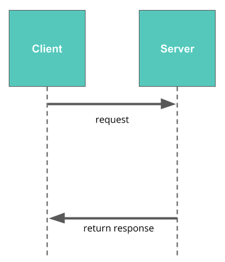

# Session 1
## Advanced Web Development
---
# Agenda
1. Introduction on Connect Weekly Sessions.
2. Communication throughout the week.
3. Projects and Plagiarism.
4. Open Discussion.
5. Relational Database.
---
## 1. Introduction on Weekly Sessions.
* Group of Udacity students with a Session Leader.
* Setting weekly targets.
* Helping each other.
* Our Goals:
    * High Completion Rate.
    * High satisfaction.
* Once a week and your presence is recorded.
* Raise your hand if you want to ask a question or to participate. 
* Please, try to engage as much as possible in the session.

---
## 2. Communication throughout the week.

[link](https://join.slack.com/t/egypt-fwd-october/shared_invite/zt-i2r17368-ELY~Ag9tUN10Er8tKfTIRQ)

---
## 3. Projects and Plagiarism
* Udacity uses plagiarism checker.
* Don’t ever copy and paste even from the lessons.
* Try to help your colleagues without handling them our code.
[What is Plagiarism?](https://udacity.zendesk.com/hc/en-us/articles/360001451091-What-is-plagiarism-)
---
## Who am I? 
> Mohamed Sayed
* Udacity 
    * Session Lead in Intro to programming Nanodegree.
    * Project Reviewer in Cloud Developer for Enterprise.
    * Session Lead in Advanced Web Development.
* Data Scientist at Optomatica.

---
## 4. Open Discussion.
- What are you currently doing?
- What are you planning to achieve?

[hint](https://roadmap.sh/backend)

---
## Weekly Schedule
[link](https://docs.google.com/spreadsheets/d/1aoy2YwR0GlgoGt-5NyadhebP5ylseLPB-4eBRfnrfOc/edit#gid=1338436519)

---
## Tools and Software
* Python3.7
* Python editor like VScode or IDE like Pycharm.
* Postgres Server.
* Postgres Client like psql12.4
---
## Relational Database.
Persist data, Central, Concurrency, Easy to retrieve.
* Database Server.
    * SQL Server, Oracle, Mongodb(not relational), **Postgress**
* Database Client.
    * MSSQL Management Studio, **PgAdmin**, **Psql**, Navicat, phpmyadmin.
* Database Connector(DBAPIs).
    * **psycopg2**, **SQLAclhemy**
---

*request*: Any sql query like insert, select, update or delete

---

> [_](https://forms.gle/1DkbXjsJ5mNyFgQw6)
