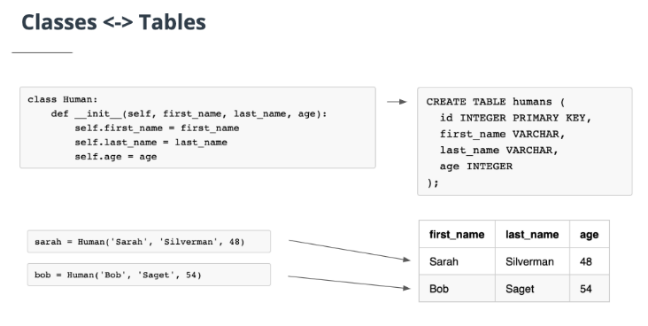
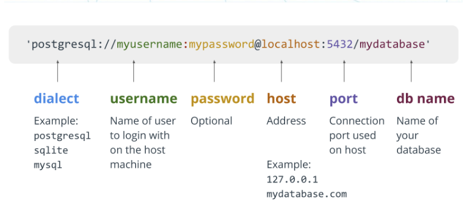

# Session 2
## Advanced Web Development
---
## Agenda
1. Why psycopg2 is not enough?
2. flask_sqlalchemy = SQLAlchemy + Flask 
---
## Problems with psycopg2
1. What are problems of writing raw sql?
* 
* 
* 
---

2. How will SQLAlchemy solves them.
* 
* 

---

---

---

---
