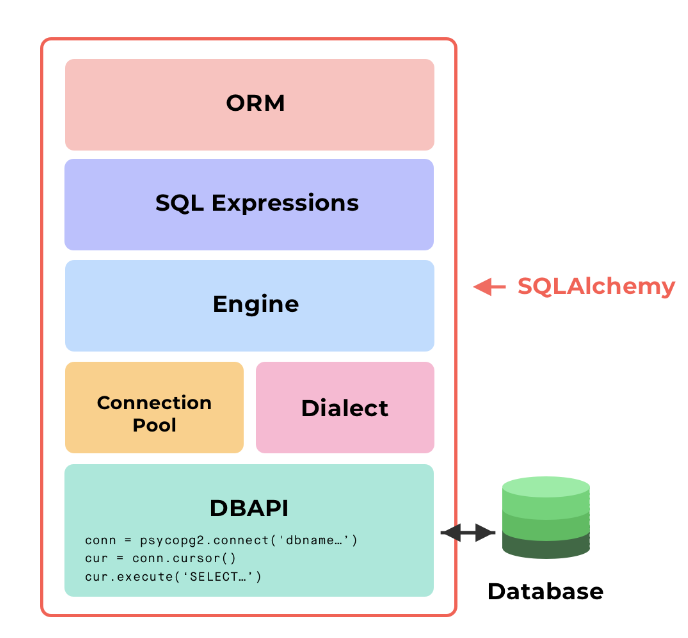

# Session 2
## Advanced Web Development
---
## Agenda
1. Why psycopg2 is not enough?
2. Intro to ORM -> SQLAlchemy.
---
## Problems with psycopg2
1. What are problems of writing raw sql?
* For every server we've to learn its dialect.
* Lots of errors. 
* Lots of sql code (copy & paste)

---

2. How will SQLAlchemy solves them.
* Sql is generated using Python.
* You write only python -> Less errors.
* Sqlalchemy handles connections with database efficiently -> Caching

---

---

---

---

---

> [_](https://forms.gle/6VWM7PMfopHMi7CY6)
