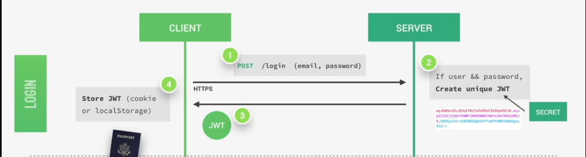
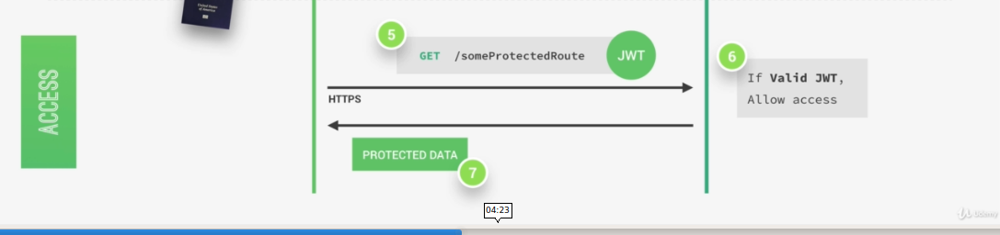
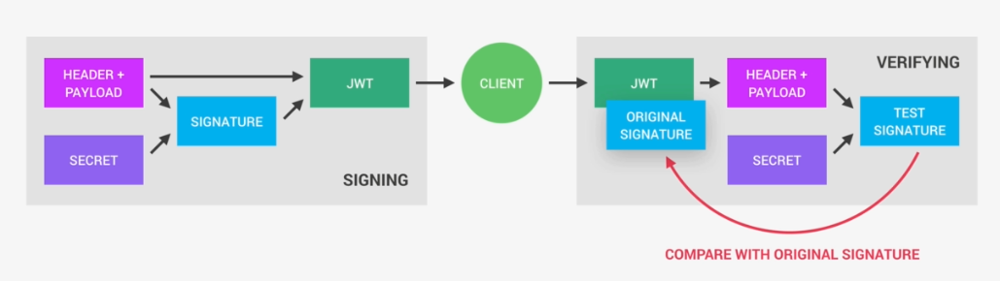

# Session 7
## Advanced Web Development
---
## Agenda
* args, kwargs
* Python decorators
* Authentication

---
## Why passowrds are bad?
* Accounts with weak passwords can be attacked.
* Passwords can be forgotten.
* Same password for all accounts -> all accounts are hacked.
* Social engineering.

---

## Solutions
* Biometrics -> fingerprint, Faceid
* Dongols
* Two-factor authentication
* __Single sign on__.

---
## Token Authentication
Delegate reponsibilities to 3rd party.

---

---

---
https://{YOUR_DOMAIN}/\
authorize?audience={API_IDENTIFIER}\
&response_type=token\
&client_id={YOUR_CLIENT_ID}\
&redirect_uri={YOUR_CALLBACK_URI}

---

> [_](https://docs.google.com/forms/d/e/1FAIpQLSeMc1qj9O1h63HdXwB8NQRxPOfSaASa6wE6RB0g_5-SYtTvwQ/viewform?usp=sf_link)