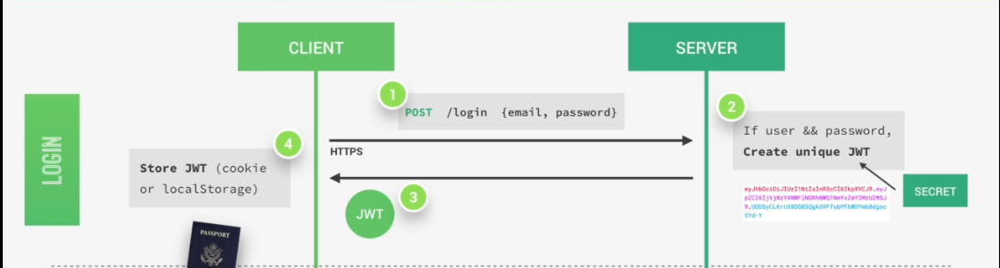
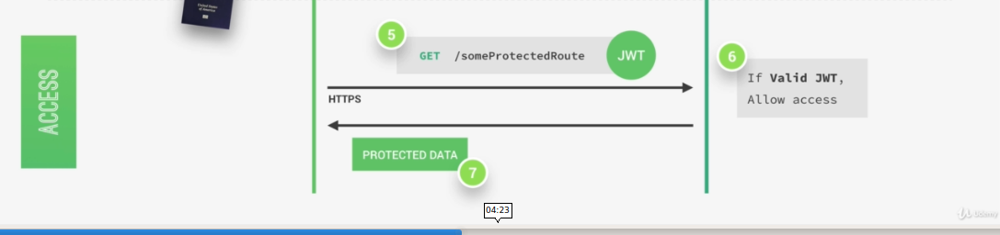
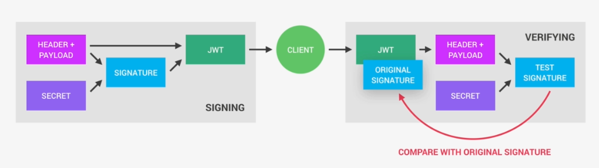

# Session 8
## Advanced Web Development
---
## Agenda
* Revisit Authentication
* Authorization
    * Permissions & roles
* What if you really want to store passwords?
    * Encryption vs Hashing
---

## Token Authentication
Delegate responsibilities to 3rd party.

---

---

---

https://ms10596.us.auth0.com/
authorize?audience=sunday
&response_type=token
&client_id=MMFAWwCM4zHFY4WWHqE2i6enUdoiyzaD
&redirect_uri=http://127.0.0.1:8100/tabs/user-page

---

Hashing | Encryption
--- | ---
 One way function |  Two way function
 MD5, SHA* | AES, DES, Caeser cipher

Symmetric | Asymettric Encryption
--- | ---
  Same key for encryption and decryption | Private key for encryption and public key for decryption 
---

